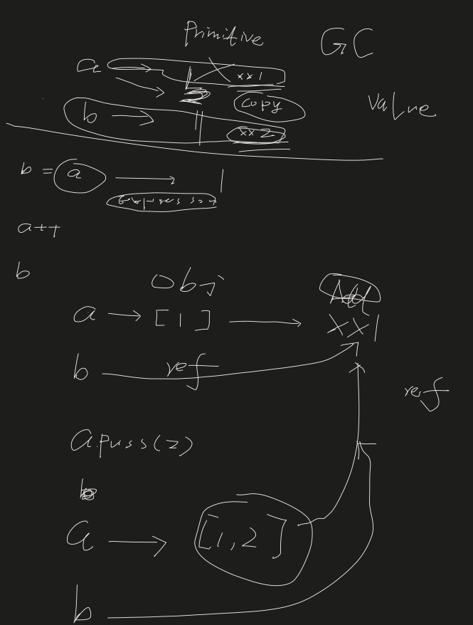
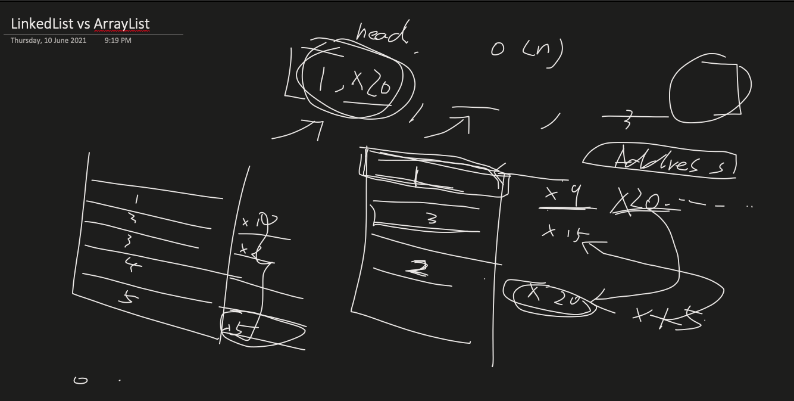

### Topics
- Java OOP basic concepts
    - Primitive vs Null Primitive
    - Pass by Value vs by reference
    - Abstraction oriented programming
    - ADT

- Sketches
    - pass by value vs by reference

    - LinkedList vs ArrayList
