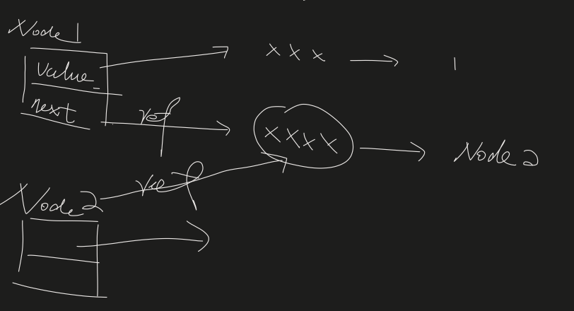
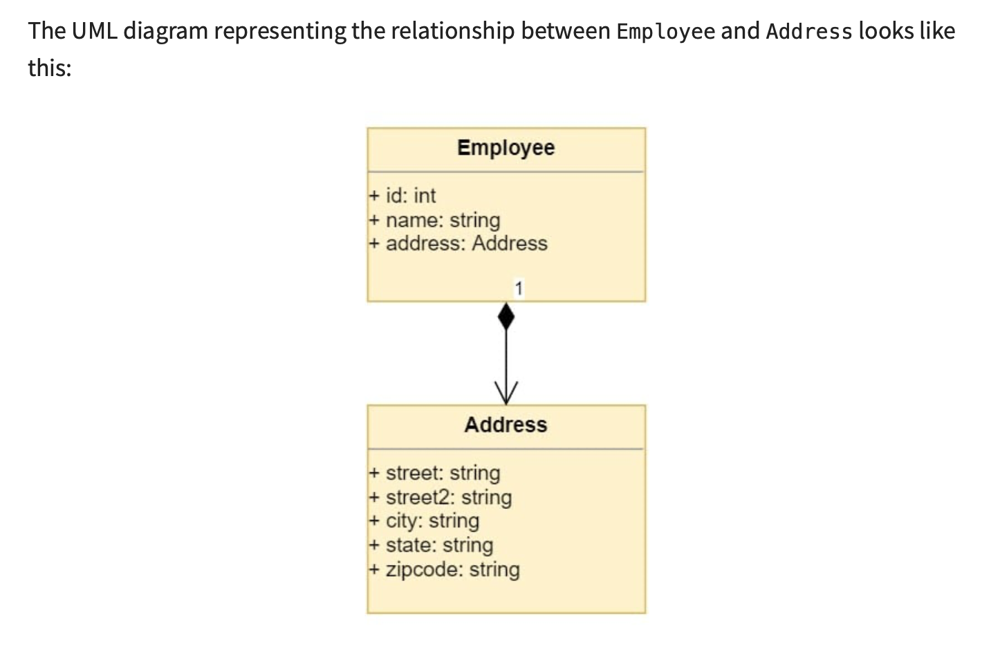
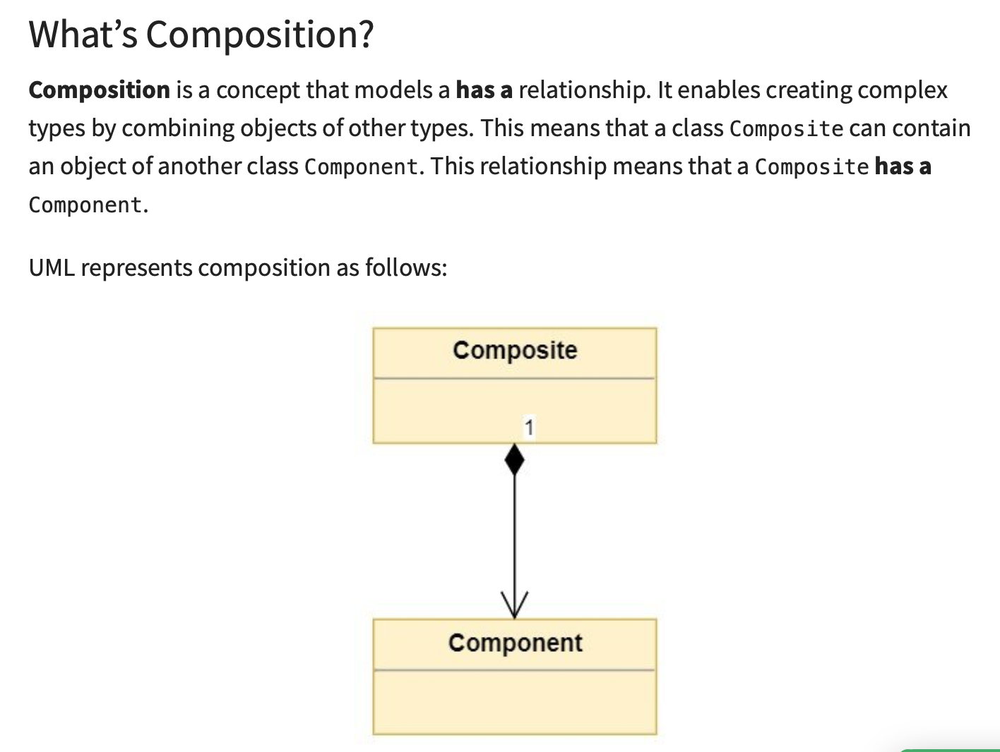

- MyNode

- MyNode assigned by reference

- MyNode class is a fatory, produced instances (similar node with different fields)
- LinkedList is the impelementation for BaseArray, by making use of on MyNode class
- Relateionship between LinkedList with MyNode: LinkedList(Composite) has one or many MyNode(Component)

- [More about composition](https://realpython.com/inheritance-composition-python/)

- LinkedList implementation

- shared one-note
https://1drv.ms/u/s!AsuHCmvUrOyUhnGGktn4b9LtVCgC