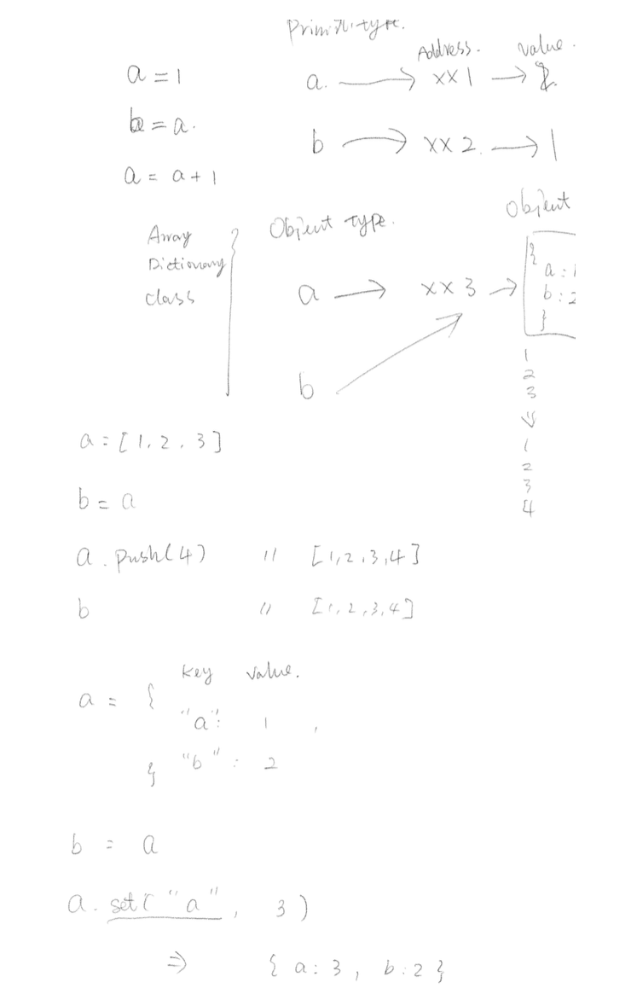
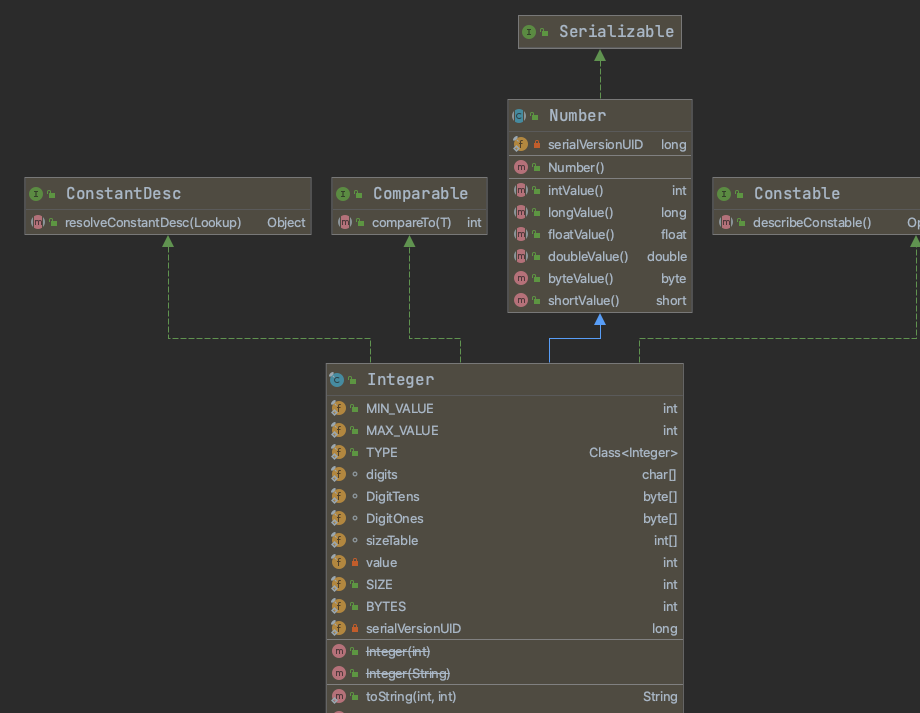

Topics/ Key Concepts
- Primitive vs Object value passing
    - pass by value (copied the value and allocated a new space)
    - pass by reference (refered to the same location)

- class for encapsulation
    - constructor
    - fields
    - methods
    - initiation
    - static
        - initiated with the class factory, only once
    - what is 'this' pointed to
        - class act as a single factory, process new instances
        - this pointed to the instance which is invoked
        - this can manipulate fileds and call methods
- UML - class diagram

- OOP 
    - type system
        - making full use of the type, since all logics can be categorised to different types, then we use class to encapulate the logics or interface to illustrate the type.
        - both class or interface are a type
        - to achieve code reusablity goal
        - the side effect is we need to learn OOP and design pattern, to design the architecture of an entire application.
            - [Design pattern](https://refactoring.guru/design-patterns/classification)
                - Creational patterns provide object creation mechanisms that increase flexibility and reuse of existing code.

                - Structural patterns explain how to assemble objects and classes into larger structures, while keeping the structures flexible and efficient.

                - Behavioral patterns take care of effective communication and the assignment of responsibilities between objects.
    - inheritence
        - parent / child class concept
        - parent class type can be assignable from a child class type
            ```java
            class A { }
            class B extends A { }

            A myA = new A();
            B myB = new B();
            
            // B can be assigned to A type ? -> yes 
            // demenstration in code 
            A.class.isAssignableFrom(B.class) == true;
            myA.getClass().isAssignableFrom(myB.getClass()) == true;

            // This way is prefered
            A myB_better = new B();
            ```
        - override
        - in java/c#/python, a class can only inherit one another class
        - can mark methods as abstract to force the child to implement
        - child will inherit all the methods and fileds except for the constructor
        - child can use `super` keyword to call parent methods
        - abstract class
            - cannot construct an instance
    - interface (todo, will talk more later, like when to use interface rather than inheritence) 
        - provide interface to client by defining the capability
        - class which implemented the interface should impelement the interface specification
        - one class can implement multi interface
- ADT
    - abstraction oriented
        - specification
    - implementation
