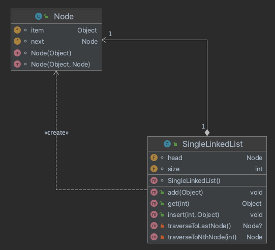

- UML composition

- TODOs
    - Pull this project from github
    `https://github.com/leo-chaoliu/cs-study-with-leo.git`
    - Create you own branch
    - Run/Debug the tutorial demo
    - Fix the linkedList get functioN
    - Commit code to your branch