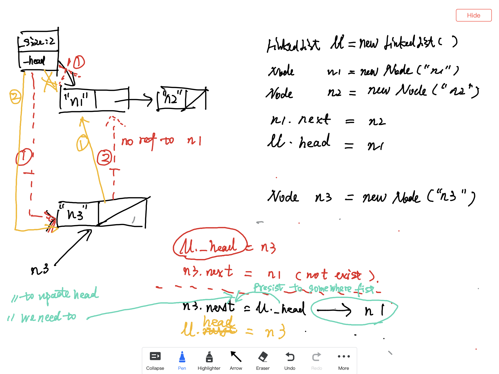

- Insert to LinkedList with illustration
    - UML 
    - LinkedListInsert1 
    - LinkedListInsert2 
    - LinkedListInsert3 
    - LinkedListTraverse1 
    - LinkedListTraverse2 
- TODO
    - Implement the `findNodeByValue` function in SingleLinkedList
    ```java
    /**
    * find a matched node for a given targetValue
    **/
    findNodeByValue(Object targetValue) : Node
    ```